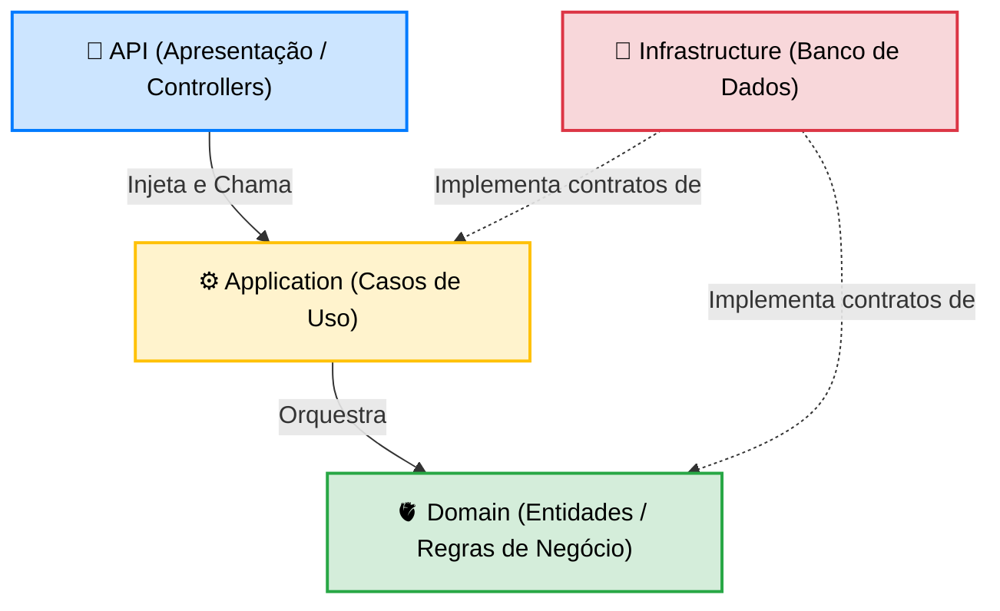
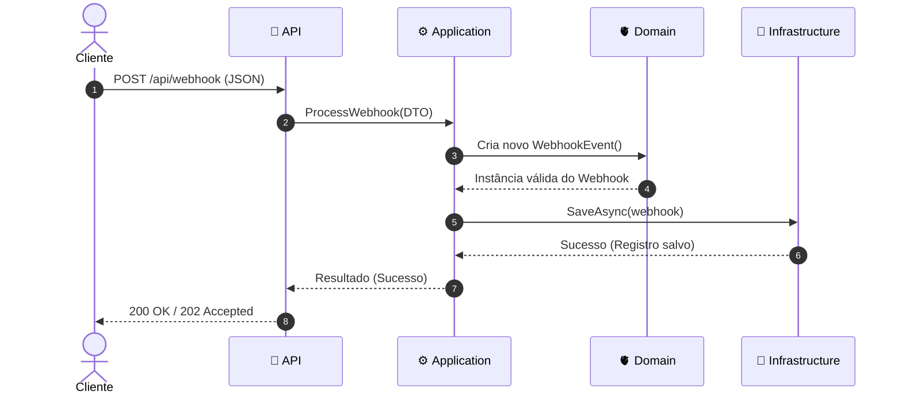

# Arquitetura e Estrutura do Projeto

Este documento explica o "porquê" de cada parte da estrutura deste projeto, que é baseada nos princípios de **Clean Architecture** (Arquitetura Limpa) e **DDD (Domain-Driven Design)**. O objetivo principal é a **separação de responsabilidades**, garantindo que as regras de negócio não se misturem com infraestrutura (como banco de dados) ou portas de entrada (como requisições HTTP).

## 1. Visão Geral em Diagramas

### Regra de Dependência (Camadas)
Todas as dependências apontam para o centro (`Domain`). As camadas externas (`Api` e `Infrastructure`) não se conhecem, elas apenas dependem do núcleo da aplicação.

### Fluxo de uma Requisição (Sequence)
O caminho de um dado quando o cliente envia um Webhook. A `Api` recebe a requisição, passa para a `Application`, que manipula o `Domain` e delega a persistência para a `Infrastructure`.

---

## 2. A Raiz do Projeto
- **`ReliableWebhookProcessor.sln` (Solution):** É o arquivo que agrupa todos os projetos. Funciona como um "fichário" que diz à IDE quais projetos compõem o ecossistema.
- **Pasta `src/` (Source):** Onde fica todo o código de produção da aplicação.
- **Pasta `tests/`:** Onde ficam os projetos de teste. O código destas pastas **não** vai para produção.

---

## 3. A Pasta `src/` (As Camadas da Aplicação)

### 🫀 `ReliableWebhookProcessor.Domain`
- **O que é:** O coração e a razão de existir do software.
- **Para que serve:** Aqui nós modelamos o mundo real. É aqui que moram entidades como `WebhookEvent`, regras de negócio e `Enums`.
- **O porquê:** O Domínio deve ser "puro". Ele **não tem dependência** de nenhum outro projeto e não sabe o que é Entity Framework ou HTTP. Ele apenas dita os contratos (interfaces).

### ⚙️ `ReliableWebhookProcessor.Application`
- **O que é:** Os Casos de Uso (Use Cases) e os fluxos da aplicação.
- **Para que serve:** Orquestra as regras. Por exemplo: *"Verifica idempotência -> Salva no banco -> Dispara processamento"*.
- **O porquê:** Separa o "fluxo do sistema" das "regras do negócio".

### 🔌 `ReliableWebhookProcessor.Infrastructure`
- **O que é:** O contato com o mundo externo (Hardware, Banco de Dados, APIs de terceiros).
- **Para que serve:** É onde o "trabalho sujo" acontece (ex: Entity Framework salvando no PostgreSQL).
- **O porquê:** Se decidirmos trocar o banco de dados, só mexemos nesta camada.

### 🚪 `ReliableWebhookProcessor.Api`
- **O que é:** A porta de entrada do usuário/cliente (Presentation Layer).
- **Para que serve:** Recebe requisições HTTP, valida o JSON, aciona a `Application` e retorna a resposta HTTP.
- **O porquê:** A regra de negócio não deveria saber o que é HTTP.

---

## 4. A Pasta `tests/`

### 🔬 `ReliableWebhookProcessor.UnitTests`
- **O que é:** Testes de Unidade. Testam uma classe ou método isoladamente usando mocks.
- **O porquê:** São extremamente rápidos e dão confiança imediata.

### 🏗️ `ReliableWebhookProcessor.IntegrationTests`
- **O que é:** Testes de Integração ou Ponta-a-Ponta (End-to-End).
- **O porquê:** Garantem que as configurações como Entity Framework, conexões e injeção de dependências estejam funcionando corretamente.
